# 学会使用这20个代理服务平台，五分钟搞定IP切换与数据采集

在跨境业务、数据采集与多账号运营的实战场景中，稳定的代理服务器是绕开地域限制、避免IP封禁的核心基础设施。如何从海量供应商中筛选出响应速度快、IP池质量高、定价透明且技术支持到位的解决方案？本文精选20家经过市场验证的住宅代理、数据中心代理及专业数据采集平台，覆盖从小型项目到企业级部署的全场景需求，助您快速完成代理配置、实现高效IP轮换与大规模Web抓取任务。

***

## **[MarsProxies](https://marsproxies.com)**

面向中小型项目的高性价比代理平台，以简洁易用与灵活定价赢得开发者青睐。

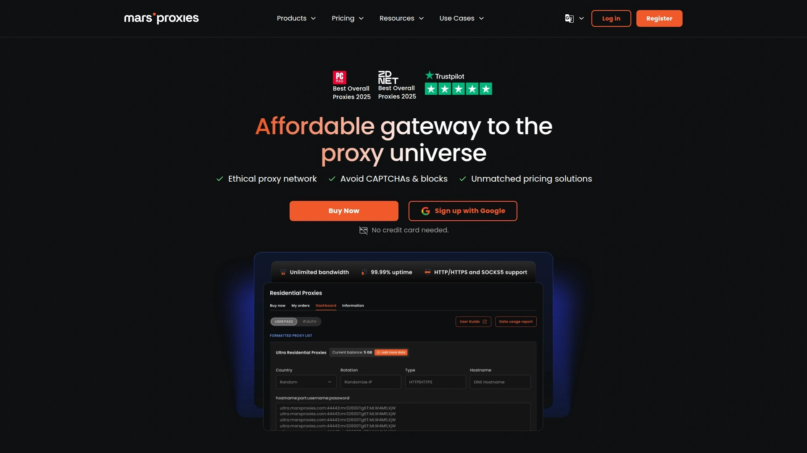

平台提供覆盖190+国家的住宅代理、数据中心代理、ISP代理及运动鞋专用代理四大产品线，住宅代理池规模超100万真实设备IP且全部通过伦理化授权获取。核心优势在于**按需付费且流量永不过期**的定价模式，用户可按1GB起步购买流量并在任意时间使用，批量购买最低可至3.5美元/GB。所有代理支持HTTP/HTTPS与SOCKS5协议，提供粘性会话（最长保持7天同一IP）与高频轮换两种模式，支持国家/州/城市三级地理定位且无额外费用。

技术实现层面，平台配备可视化控制面板实时追踪流量消耗与IP分布情况，支持双重身份验证（IP白名单或用户名密码）确保账号安全。无限并发连接能力配合API文档与代码示例（Python/Node.js等），可快速集成至Scrapy、Selenium等主流爬虫框架。24×7技术支持团队通过在线聊天与邮件渠道响应用户问题，平均响应时间控制在分钟级。特别适合预算有限但需要稳定代理服务的独立开发者、初创团队及中小企业，在Web抓取、社交媒体管理、SEO监控及电商价格追踪等场景表现出色。

***

## **[Bright Data](https://brightdata.com)**

全球规模最大的Web数据平台，拥有1.5亿+住宅IP池及财富500强企业背书。

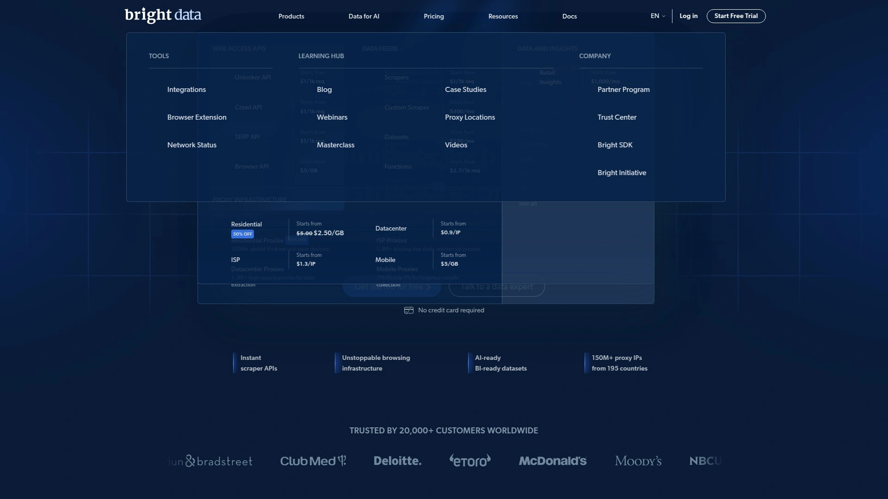

作为行业标杆级供应商，Bright Data维护覆盖195个国家/地区的代理网络，支持国家/城市/邮编/ASN级精准定位且完全免费。采用QUIC协议（基于HTTP/3）实现0.7秒平均响应时间，成功率稳定在99.95%以上。所有住宅IP经过严格伦理审核，来源于明确授权的真实设备避免合规风险。提供无限并发会话、粘性与轮换模式自由切换，配备免费Proxy Manager工具简化配置流程。

平台内置AI驱动的自动重试机制、CAPTCHA处理、浏览器指纹管理及JavaScript渲染能力，用户可通过API直接获取结构化数据无需自建爬虫架构。除代理服务外还提供现成数据集下载与定制化采集方案，定价按GB计费且透明公开，大规模用户可协商定制方案。99.99% SLA保障服务稳定性，专属客户成功团队协助方案设计与技术落地，特别适合需要端到端数据解决方案的企业客户，在AI训练数据采集、金融市场情报、品牌保护等场景占据领先地位。

***

## **[Oxylabs](https://oxylabs.io)**

欧洲领军的高质量代理与Web智能采集服务商，提供覆盖160+国家的多类型IP资源。

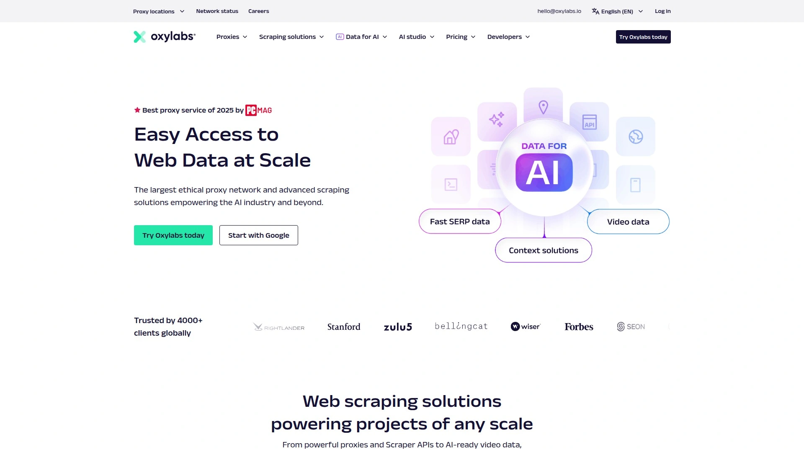

代理池包含超1亿住宅IP与500万+移动IP，支持700+移动运营商精准筛选（Verizon、Vodafone等），所有IP通过伦理化流程采集且来自真实家庭宽带设备。除住宅代理外还提供数据中心代理、ISP代理及专用移动代理等选择，响应速度快且IP信誉度高适合长期项目。平台集成Web Scraper API与SERP Scraper API，可直接获取电商、搜索引擎、社交媒体等结构化数据。

技术文档详尽配备专属客户成功团队协助方案设计与故障排查，支持HTTP/HTTPS/SOCKS5协议及会话控制、地理定位、自定义请求头等高级功能。定价透明且提供灵活套餐选择，企业用户可申请定制方案与专属技术支持通道。特别适合AI训练数据采集、市场情报分析、品牌保护及需要低封禁率的长周期数据任务。

***

## **[NetNut](https://netnut.io)**

直连ISP骨干网的高速代理提供商，独家技术实现行业领先的响应速度与稳定性。

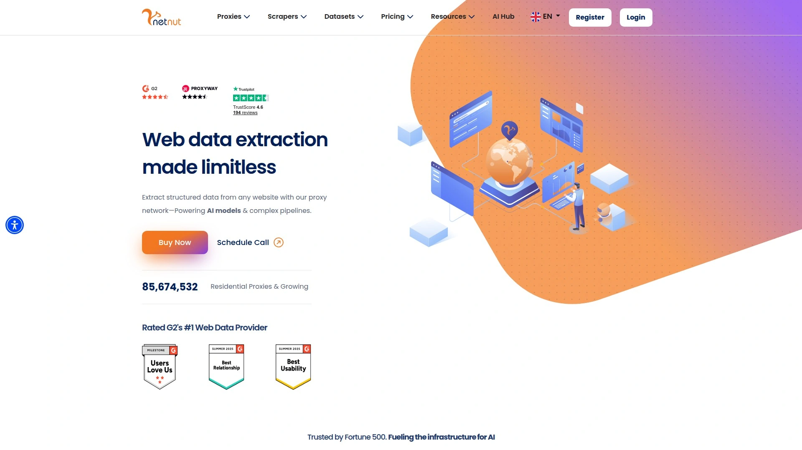

区别于传统P2P代理网络，NetNut的8500万+住宅IP与500万+移动IP均通过与全球ISP直接合作获取，绕过中间层级将延迟降至600ms以下并实现42%成本节省。所有IP支持24/7可用且可分配专属代理池避免共享导致的IP污染问题，提供静态住宅IP选项适合账号管理、社交媒体运营及广告投放场景。

支持无限并发请求、自定义代理轮换频率、ASN级定位及实时流量监控仪表板，协议覆盖HTTP/HTTPS/SOCKS5兼容Scrapy、Selenium、Puppeteer等主流框架。定价按流量或按端口计费均可选择，企业用户可申请定制化解决方案与专属技术支持通道。特别适合电商SEO、球鞋抢购、票务系统及大规模数据采集项目。

***

## **[IPRoyal](https://iproyal.com)**

以高性价比著称的全栈代理服务商，提供住宅/数据中心/移动/ISP代理全覆盖。

拥有3200万+住宅IP池覆盖195个国家，支持国家/城市/ISP级精准定位，代理响应速度稳定在1秒以内。除传统代理外其IPRoyal Pawns项目允许用户通过共享闲置带宽获得收益，从源头保障IP质量与伦理合规性。提供专用数据中心代理与静态住宅代理（ISP代理）选择，后者结合住宅IP高信誉度与数据中心稳定性非常适合长周期账号养号与自动化任务。

平台支持HTTP/HTTPS/SOCKS5协议，提供API接口与浏览器扩展插件两种使用方式上手门槛低。定价按流量或按端口数计费均可，小额用户可按需购买无长期合约束缚。7×24小时技术支持响应迅速，文档涵盖Python、Node.js、PHP等主流语言集成示例，适合个人开发者、中小企业及对成本敏感的高频数据采集场景。

***

## **[SOAX](https://soax.com)**

以道德化采集理念与透明化运营著称的代理平台，提供1.55亿+住宅与移动IP资源。

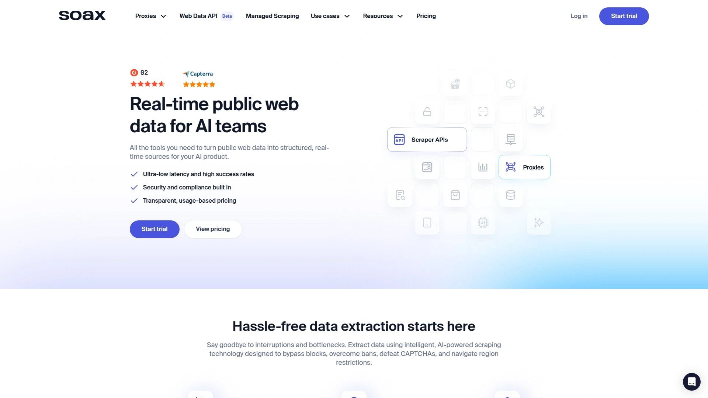

覆盖195+国家与地区，所有IP通过用户明确授权获取，平台总部位于英国严格遵守GDPR等数据保护法规。支持HTTP/HTTPS/SOCKS5/UDP/QUIC多种协议，其中QUIC基于UDP传输显著提升连接速度与稳定性。代理池支持粘性会话（最长30分钟同一IP）与高频轮换模式切换，可根据目标网站反爬策略灵活调整。

适用场景广泛：价格监控、库存追踪、广告验证、SEO排名检测与社交媒体数据采集。平台提供可视化控制面板实时查看流量消耗与IP分布，支持按国家/城市甚至ZIP代码级定位。定价按流量计费且阶梯折扣明显，大流量用户可获定制报价。提供API文档与代码示例兼容Scrapy、Selenium等主流框架，技术支持团队可协助解决复杂反爬挑战。

***

## **[Webshare](https://webshare.io)**

聚焦性价比与易用性的快速代理解决方案，提供免费套餐吸引初学者与轻量用户。

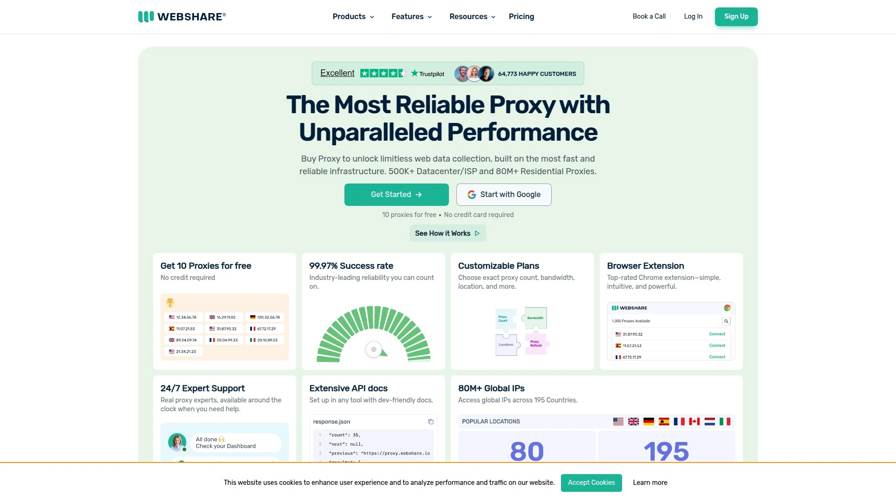

免费提供10个代理IP供新用户测试，付费套餐起步价低且无隐藏费用支持按月订阅或按需充值。代理池包含数据中心代理、住宅代理及ISP代理三大类型，所有代理支持HTTP/HTTPS/SOCKS5协议响应速度快且连接稳定。平台界面简洁直观提供一键生成代理列表功能，可按国家筛选并导出配置文件非常适合快速部署小型项目。无限带宽、无并发限制、99.9%在线率保障配备实时监控仪表板追踪流量使用情况。

API接口友好支持自动化脚本集成，文档包含Python、Node.js等主流语言示例代码。客户支持通过邮件与在线聊天提供响应速度较快。定价透明且灵活适合预算有限的个人开发者、学生用户及初创团队进行Web抓取、SEO工具开发或市场调研等轻量级任务。

***

## **[ProxyScrape](https://proxyscrape.com)**

专注免费与付费代理混合供应的资源聚合平台，提供多元化IP获取途径。

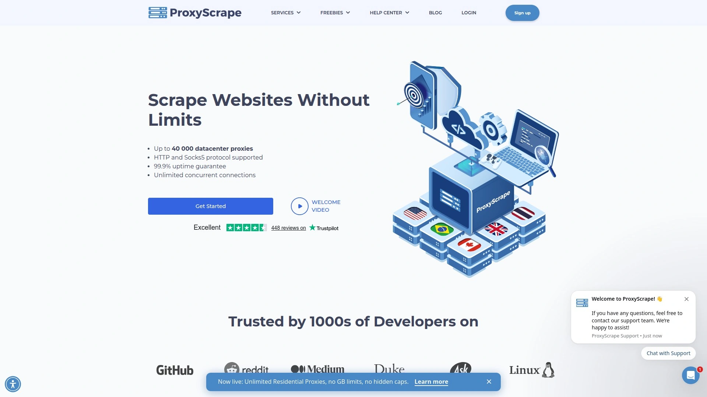

同时提供免费公共代理列表与高级付费代理服务，免费代理池每日更新支持HTTP/HTTPS/SOCKS4/SOCKS5协议满足基础测试需求。付费住宅代理覆盖全球主要国家支持API调用与浏览器扩展两种方式，响应时间控制在合理范围。平台特色在于可按需购买短期代理（小时级计费）适合临时性高强度任务如限时抢购或活动监控。提供代理检测工具免费验证IP可用性、匿名级别及响应速度帮助用户快速筛选优质资源。

付费套餐支持无限带宽与线程数配备自动IP轮换功能降低封禁风险。文档涵盖主流编程语言与爬虫框架集成指南，客户支持通过LiveChat与邮件渠道提供。价格策略灵活既有月付套餐也有按流量计费选项，适合预算敏感且需要灵活扩展的个人用户与中小型数据采集项目。

---

## **[Geonode](https://geonode.com)**

快速成长的批发级代理供应商，以高性价比住宅与移动代理服务占据市场份额。

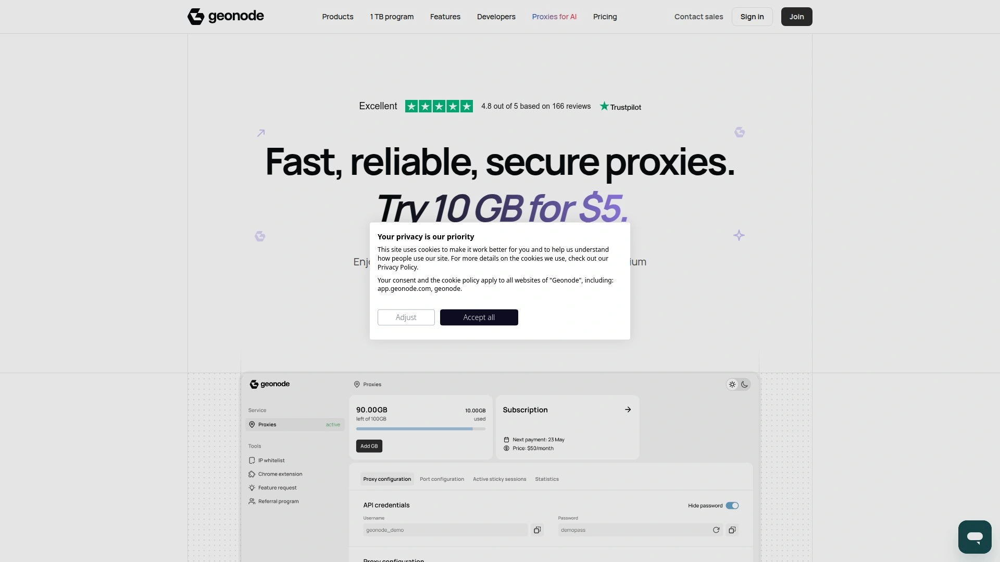

提供3000万+代理IP覆盖45个国家/地区，支持住宅代理、数据中心代理与移动代理三大类型全部支持SOCKS5/HTTPS协议切换。代理池通过自有IP采集平台（Repocket、Zenshield）获取确保完整控制权与IP质量，所有IP经过伦理化授权流程用户明确同意共享网络资源。批量购买10TB起步价低至0.5美元/GB相比行业平均水平节省30%以上成本。

支持白标代理转售计划技术团队提供API文档与集成指导协助快速搭建自有代理服务。平台界面提供实时流量监控、地理位置筛选及代理格式自定义功能操作门槛低。提供5美元试用套餐供新用户测试，适合需要大流量稳定供应的数据采集公司、SEO工具开发商及代理转售商。

***

## **[Infatica](https://infatica.io)**

强调道德采集与高质量IP池的专业代理服务商，面向企业级数据采集场景。

拥有1500万+住宅IP与移动IP覆盖131个国家，所有代理通过用户明确授权与参与激励机制获取确保IP来源透明且合规。支持国家/地区/城市/ISP/运营商多级地理定位，代理响应时间稳定在0.4秒以内99.9%正常运行时间由SLA保障。平台提供IP轮换自定义（按时间或按请求）、双重身份验证及无限代理列表生成等高级功能。

完整的API集成能力配合详细文档支持Python、Node.js、PHP等主流编程语言可快速嵌入现有数据管道。控制面板功能强大实时显示流量消耗、IP分布及连接状态支持导出数据报告用于成本分析与优化。提供灵活定价方案，技术支持团队7×24小时在线协助解决CAPTCHA绕过、反爬策略应对等复杂问题，特别适合金融数据采集、旅游价格监控及市场情报分析等对稳定性要求严苛的场景。

***

## **[Zyte](https://zyte.com)**

网页抓取领域先驱企业，Scrapy框架创建者提供的全栈数据提取解决方案。

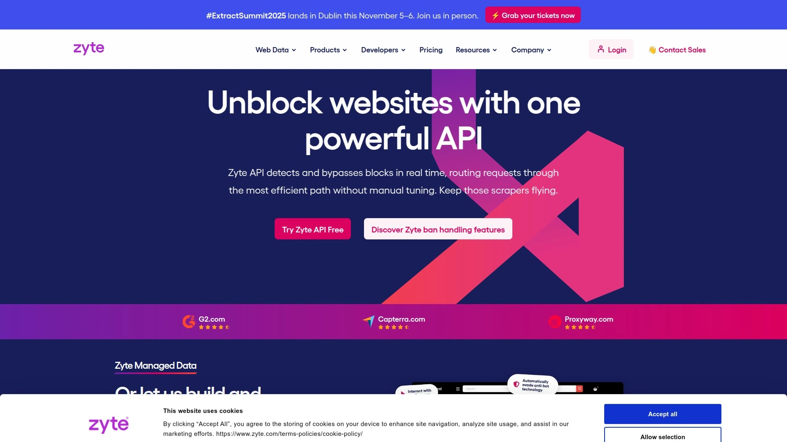

拥有15年以上行业经验从开源爬虫框架Scrapy起步逐步构建商业化数据采集生态。Zyte平台整合代理服务、浏览器渲染、JavaScript执行、CAPTCHA自动处理及反爬绕过能力于一体，用户只需提交目标URL即可获得结构化数据无需自建爬虫架构。支持全球主要电商网站、搜索引擎及社交媒体平台的模板化提取API接口简洁高效。

Smart Proxy Manager自动选择最优代理IP与请求头配置显著提升成功率，提供云端浏览器集群处理复杂交互页面支持定时任务与Webhook回调实现自动化数据管道。定价按请求数或数据量计费透明且可预测。技术文档与社区资源丰富提供Python/Node.js SDK与RESTful API多种接入方式。适合需要快速启动且无需深度技术投入的企业用户，尤其在电商价格监控、竞品分析、内容聚合及AI训练数据采集方面表现出色。

***

## **[ScraperAPI](https://scraperapi.com)**

一站式网页抓取API服务，将代理管理、浏览器模拟与反爬突破能力打包为单一接口。

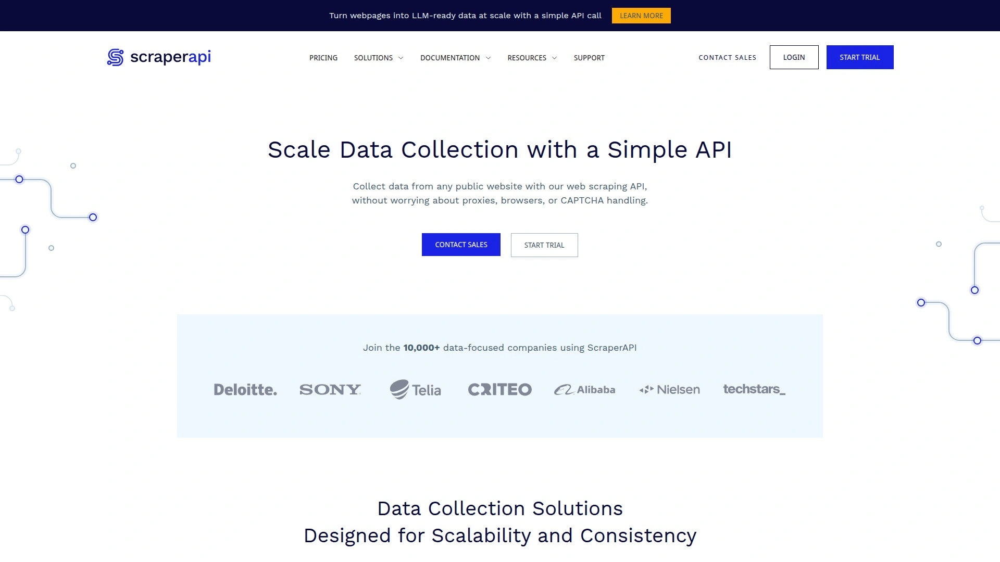

平台后端维护数千万代理IP池自动处理IP轮换、请求头注入、Cookie管理及常见CAPTCHA识别，用户仅需发送HTTPS请求即可获取HTML或JSON格式数据。支持JavaScript渲染模式应对动态加载页面，提供地理位置定位、自定义请求参数及会话保持等高级功能。API请求成功率高达99%以上失败请求自动重试且不计费有效控制成本。

使用场景广泛从产品价格追踪、库存监控、SEO关键词排名到社交媒体数据采集均可快速实现。提供免费套餐包含5000次请求供新用户测试，付费套餐按调用次数分级定价且阶梯折扣明显。集成简单无需复杂配置官方提供Python、Node.js、Go等多语言SDK及详尽代码示例。技术支持响应迅速文档包含常见网站抓取最佳实践与故障排查指南，非常适合需要快速交付且无需维护代理基础设施的开发团队与数据分析师。

***

## **[Rayobyte](https://rayobyte.com)**

提供多样化代理类型与灵活定价方案的综合代理服务商，满足不同场景需求。

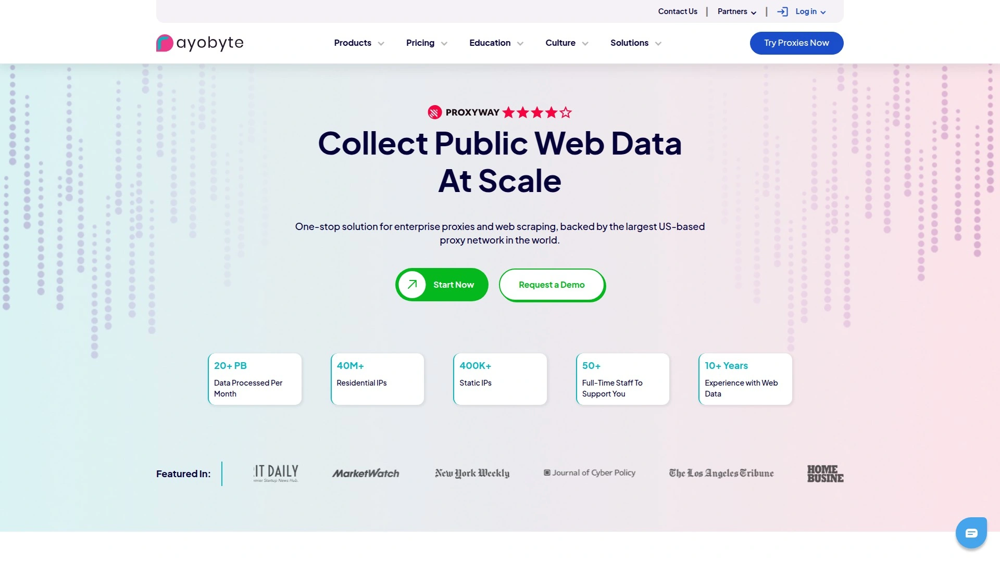

代理池覆盖住宅代理、数据中心代理、ISP代理及移动代理全系列产品支持按流量计费或按端口包月两种模式。住宅代理池规模达数千万级覆盖全球主要国家支持城市级定位及ISP筛选响应速度与稳定性表现优异。数据中心代理提供专用与共享两种选项前者独享IP适合长期账号管理后者成本更低适合高频抓取任务。

提供代理测试工具免费验证速度与匿名性支持自定义代理轮换策略配备API接口实现动态IP管理。平台文档详尽涵盖Scrapy、Selenium、Puppeteer等主流框架集成示例技术支持团队可协助设计定制化解决方案。定价灵活且透明大批量用户可申请折扣与专属客户经理服务。适合需要混合使用多种代理类型以应对不同网站反爬策略的企业客户，尤其在SEO监控、广告验证、价格对比及社交媒体数据采集方面表现出色。

---

## **[The Social Proxy](https://thesocialproxy.com)**

专注社交媒体平台管理的专业移动代理供应商，提供高信誉度4G/5G IP资源。

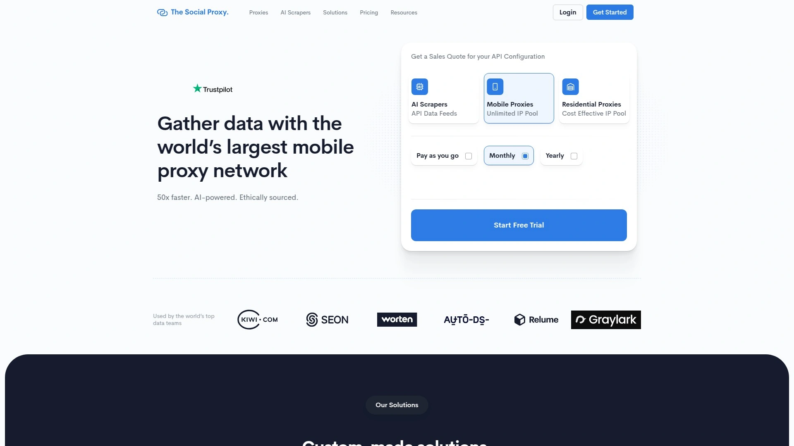

移动代理池直连全球主流运营商（AT&T、T-Mobile、Orange等）IP信誉度高且极少被社交平台标记为可疑流量。支持Instagram、Facebook、Twitter、TikTok等平台的多账号管理IP轮换策略针对社交媒体反爬机制优化可显著降低账号封禁风险。提供粘性会话保持30分钟至24小时同一IP适合需要模拟真实用户行为的自动化任务如点赞、评论、关注等操作。

支持HTTP/HTTPS/SOCKS5协议提供API接口与浏览器扩展两种使用方式配备实时IP池监控工具查看可用代理数量与地理分布。定价按流量或按端口计费均可选择提供按需购买短期套餐满足临时性活动需求。平台文档包含主流社交媒体自动化工具（Jarvee、FollowLiker等）集成指南技术支持团队熟悉社交平台规则可提供合规建议。特别适合社交媒体营销机构、网红经纪公司、品牌推广团队及需要批量管理账号的电商卖家。

***

## **[Proxy Empire](https://proxyempire.io)**

新兴高性价比代理服务商，以灵活套餐与优质客户服务赢得市场认可。

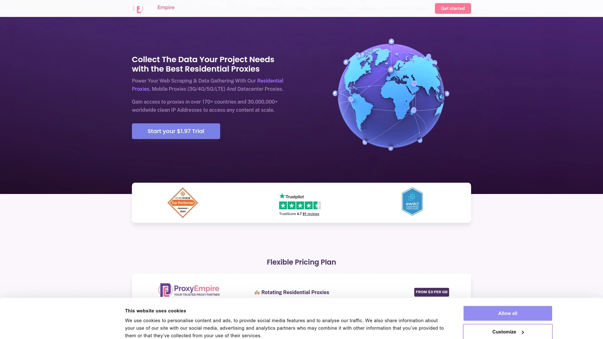

提供530万+住宅代理与移动代理覆盖170+国家支持国家/城市/ISP级精准定位代理响应速度快且连接稳定性高。所有IP经过严格质量筛查确保低封禁率特别适合需要高成功率的电商采集、价格监控及SEO工具开发。平台支持HTTP/HTTPS/SOCKS5协议提供粘性会话与高频轮换两种模式用户可根据目标网站特点灵活调整策略。

7×24小时技术支持响应迅速且问题解决效率高提供API文档与主流编程语言示例代码配备可视化控制面板实时监控流量与IP使用情况。定价按流量计费且透明无隐藏费用大批量用户可申请定制报价与折扣方案。提供免费试用额度帮助新用户评估代理质量退款政策灵活降低试错成本。适合预算有限但对服务质量有明确要求的中小企业、独立开发者及初创团队尤其在跨境电商数据采集、广告验证及市场调研等场景表现优异。

***

## **[PacketStream](https://packetstream.io)**

点对点住宅代理网络，提供真实用户IP资源与灵活的转售方案。

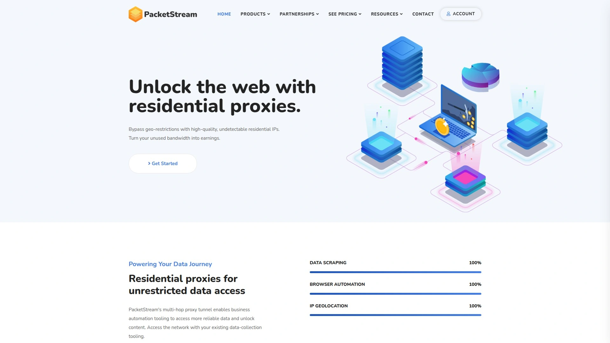

采用P2P架构从全球真实用户（Packeters）处获取住宅IP资源所有参与者明确授权共享闲置带宽并获得被动收益。代理池覆盖全球主要国家IP信誉度高适合需要模拟真实用户访问的场景如市场调研、内容访问及安全测试。平台提供白标转售API允许企业在自有品牌下提供代理服务无需披露使用第三方供应商自定义定价与服务模式。

转售价格固定在1美元/GB定价透明且可预测便于预算规划。支持HTTP/HTTPS/SOCKS5协议配备完整API文档与专属支持团队协助集成流程。安全与隐私保障到位采用内置加密与高级安全措施保护数据传输所有客户交互均经过匿名化处理。特别适合希望快速启动代理转售业务的企业、数据分析公司及需要扩展服务产品线的技术供应商。

***

## **[Lime Proxies](https://www.limeproxies.com)**

老牌私有代理供应商，专注SEO工具与匿名浏览场景提供高速代理服务。

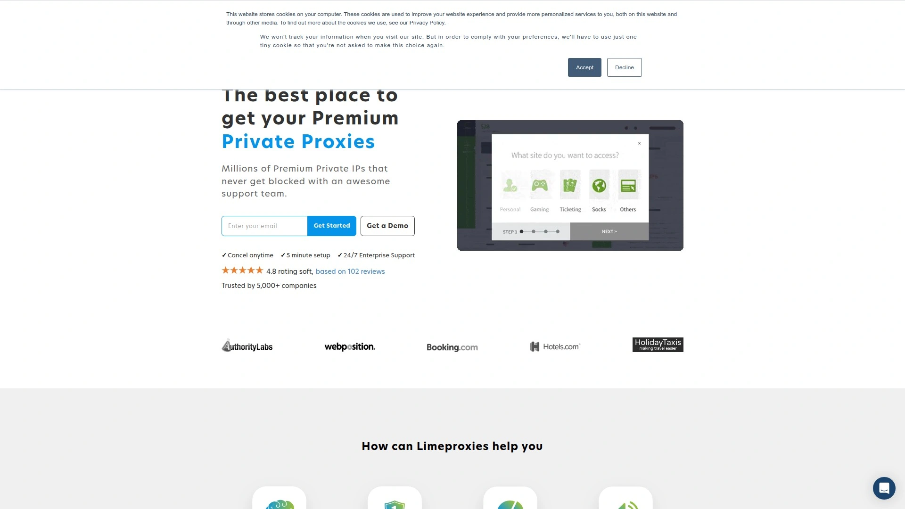

拥有220+服务器节点提供私有代理服务针对SEO工具（Scrapebox、SEnuke、TweetAttacks等）优化性能。所有代理为专用IP确保高匿名性与稳定连接支持HTTP/HTTPS与SOCKS5协议。平台保障99.9%以上在线率配备24×7技术支持团队通过邮件与在线聊天渠道响应用户问题。定价起步价低至每月1.13美元/代理适合需要长期稳定IP的SEO专业人员、社交媒体营销人员及需要保护隐私的个人用户。

提供按月订阅套餐无需长期合约束缚用户可随时调整代理数量。控制面板简洁直观支持一键生成代理列表与配置导出功能。文档包含主流SEO工具与自动化软件的集成指南降低配置门槛。特别适合从事链接建设、关键词排名监控、社交媒体自动化及内容发布的数字营销从业者。

***

## **[MyPrivateProxy](https://www.myprivateproxy.net)**

专业私有代理提供商，针对SEO与匿名浏览场景优化的高性能代理解决方案。

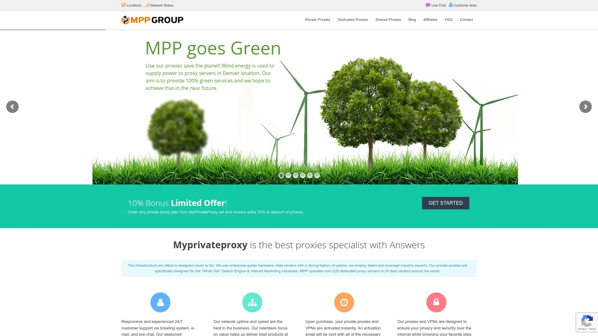

提供专门为SEO工具（Scrapebox、Reddit、BookmarkWiz等）优化的高速高匿私有代理。所有代理为专用IP确保完整控制权与隐私保护支持HTTP/HTTPS协议。平台保障稳定连接与高在线率配备技术支持团队协助用户解决配置与使用问题。定价透明按代理数量计费适合需要固定IP进行长期任务的SEO专业人员与数字营销团队。

会员区域提供实时统计数据追踪代理使用情况与性能表现。平台运营多年积累丰富行业经验针对常见SEO工具提供预配置方案降低用户学习成本。支持按月付款无需预付大额费用降低使用门槛。特别适合从事SEO优化、内容营销、社交媒体管理及需要保护IP隐私的个人用户与小型团队。

***

## **[Shifter](https://shifter.io)**

成立于2012年的老牌代理服务商，提供3100万+IP地址的住宅代理与数据采集基础设施。

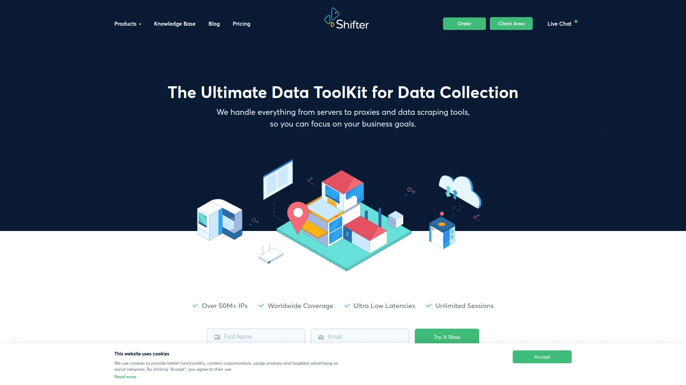

平台提供轮换住宅代理、静态住宅代理及运动鞋专用代理三大产品线覆盖全球主要国家与城市。所有代理支持HTTP/HTTPS与SOCKS协议提供无限连接会话能力适合大规模并发任务。99.99%在线率保障配合高连接速度确保数据采集任务稳定运行。平台提供便捷控制面板实时监控代理使用情况与流量消耗支持快速切换代理配置。

技术支持团队24×7在线通过多渠道响应用户问题提供3天退款保障降低试错成本。定价合理无需额外支付技术工具费用专注提供可靠代理服务本身。适合需要稳定代理基础设施的用户群体包括价格对比、广告验证、品牌保护、网站测试、SEO数据采集、电商数据抓取及多社交媒体账号管理等场景。特别适合理性用户与注重性价比的专业人士。

***

## **[Proxy-Cheap](https://www.proxy-cheap.com)**

提供白标转售方案的代理供应商，助力快速启动自有品牌代理业务。

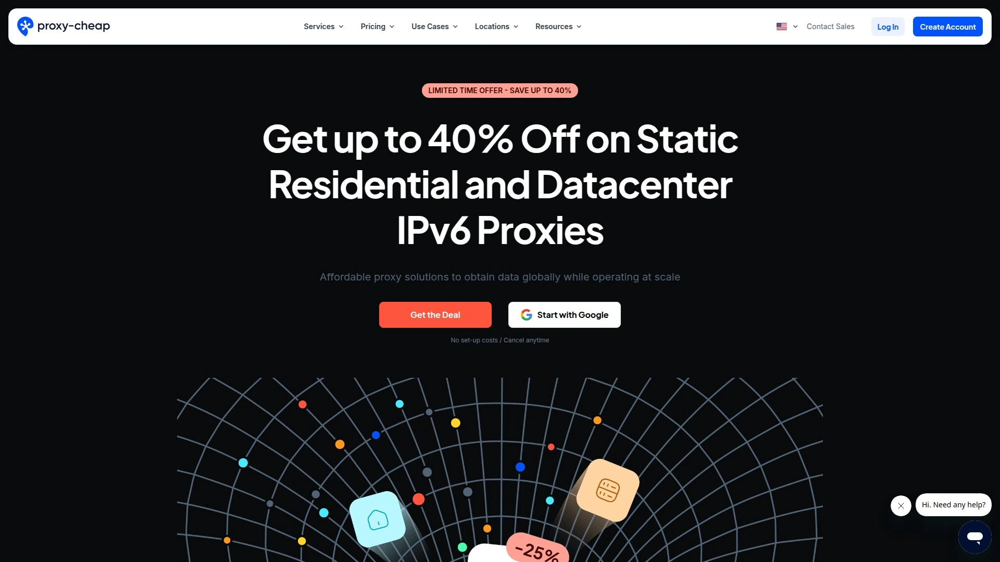

平台提供数据中心代理、静态住宅代理、住宅轮换代理及移动代理四大类型产品支持转售商在自有品牌下销售代理服务。白标转售模块与WHMCS平台无缝集成通过向导式安装流程快速搭建全功能代理业务系统。自动化订单处理机制免除手动配置负担客户下单后系统自动分配代理资源节省运营成本。

转售商可完全控制客户账号管理、代理使用监控、资源分配及定价策略实现业务自主化运营。灵活的分级定价结构允许转售商根据自身需求选择合适档位无需大额初始投资即可启动业务Tier 0计划无需押金。配备专属技术与管理支持团队提供长期协助。强大的API支持实现快速连接与资源访问保障客户体验。特别适合希望进入代理市场但不想自建基础设施的企业家、技术服务商及希望扩展产品线的现有业务运营者。

***

## **[Decodo](https://decodo.com)**

前身为Smartproxy的全球代理与数据采集基础设施平台，服务8.5万+用户的一站式解决方案。

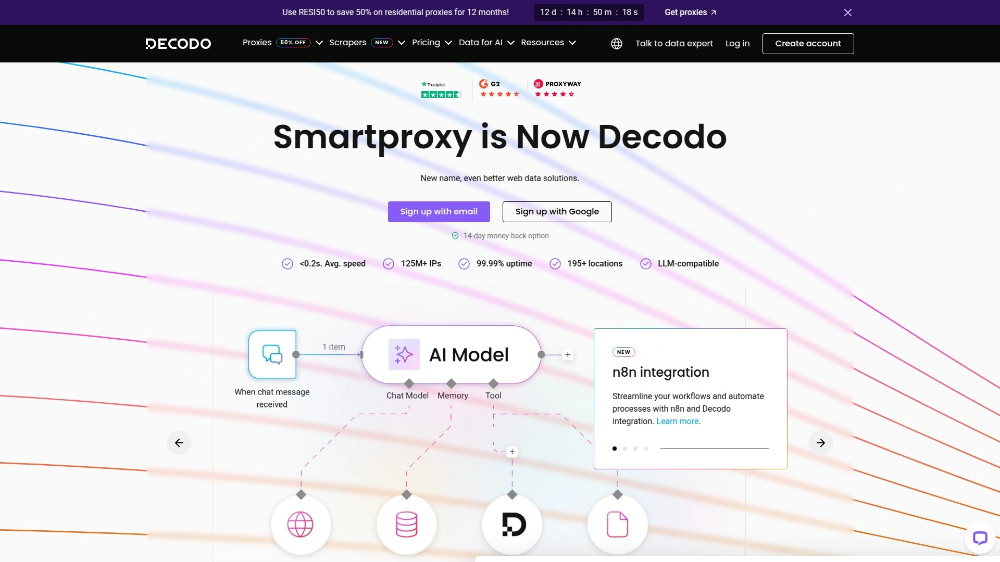

自2018年起深耕代理服务领域Decodo提供1.25亿+真实设备IP池覆盖住宅代理、静态ISP代理、移动代理及数据中心代理四大类型全部支持粘性会话（最长24小时保持同一IP）。其Site Unblocker高级方案可绕过复杂反爬系统配合Web Scraping API实现开箱即用的数据采集能力。平台支持195+国家及地区定位代理池直连ISP而非P2P网络响应时间控制在600ms以内成功率高达99.5%以上。

核心优势包括按需付费的灵活定价、7×24小时技术支持、完整的API文档及可视化控制面板适合从初创团队到企业级用户的各类Web数据项目。无论是SEO监控、广告验证、电商价格追踪还是社交媒体自动化Decodo的多协议支持（HTTP/HTTPS/SOCKS5）与无限并发能力均可满足高强度任务需求。提供免费试用额度新用户可快速验证代理质量与项目适配性。

***

## 常见问题

**如何选择适合自己的代理类型？**
住宅代理来自真实设备IP信誉度高不易被封禁适合社交媒体管理、电商账号运营等需要模拟真实用户的场景；数据中心代理速度更快成本更低适合大规模价格监控、SEO排名检测等对速度敏感的任务；ISP代理结合两者优势提供稳定IP与高信誉度适合长期账号管理。建议根据目标网站反爬强度、预算与任务性质选择或混合使用多种类型提升灵活性。

**代理服务器的响应速度与成功率如何评估？**
优质代理服务商通常承诺99%以上成功率及1秒以内响应时间建议在选择前申请免费试用测试实际性能。重点关注目标地区的IP池密度、粘性会话稳定性及高峰时段连接质量。可通过技术文档了解是否支持自动重试机制与失败请求退款政策确保实际使用成本可控。同时查看第三方评测与用户评价获取更客观的性能数据。

**初学者如何快速上手代理配置？**
优先选择提供详尽文档、代码示例及可视化控制面板的平台如MarsProxies、Webshare等均提供主流编程语言（Python、Node.js）的快速集成指南。从小流量套餐或免费试用开始测试熟悉API调用流程与错误处理机制后再扩大规模。利用平台提供的Proxy Manager工具或浏览器扩展可降低配置门槛技术支持团队的响应速度与专业度也是快速解决问题的关键。建议先从单一应用场景入手逐步扩展到多场景使用。

***

## 总结

综合考量IP池规模、全球覆盖范围、响应速度与成本效益，[MarsProxies](https://marsproxies.com)凭借190+国家覆盖、100万+伦理采集IP、流量永不过期的灵活定价模式及24×7技术支持，特别适合需要快速启动且追求高性价比的中小型数据采集项目与多账号运营场景。其简洁易用的控制面板配合主流框架集成能力使得独立开发者与初创团队可在五分钟内完成代理配置并投入实际使用。无论是跨境电商价格监控、社交媒体管理还是SEO数据采集，合理选择代理工具并配合科学的IP轮换策略即可显著提升任务成功率与业务决策质量。
